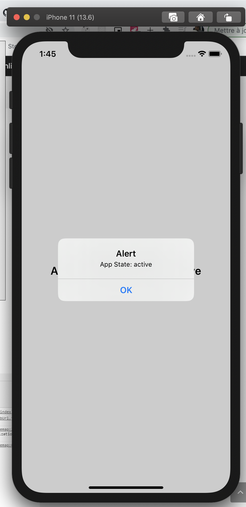
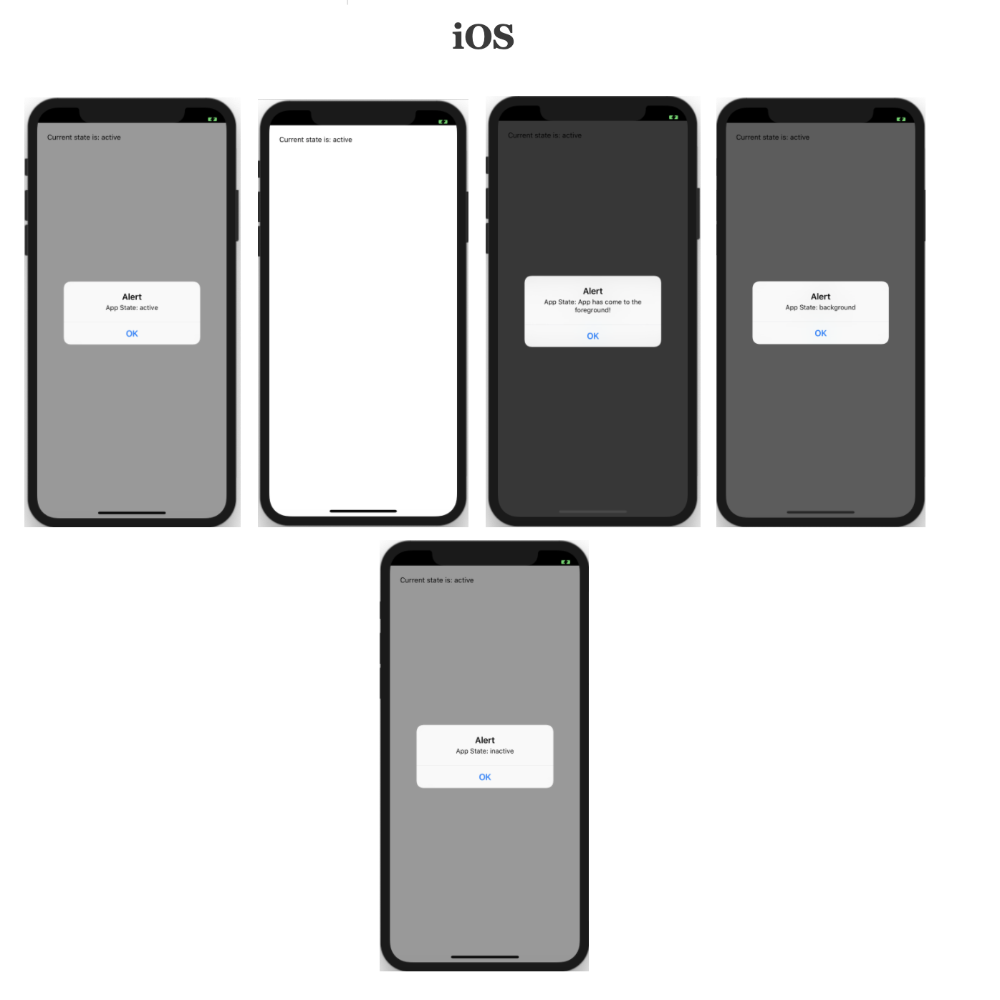
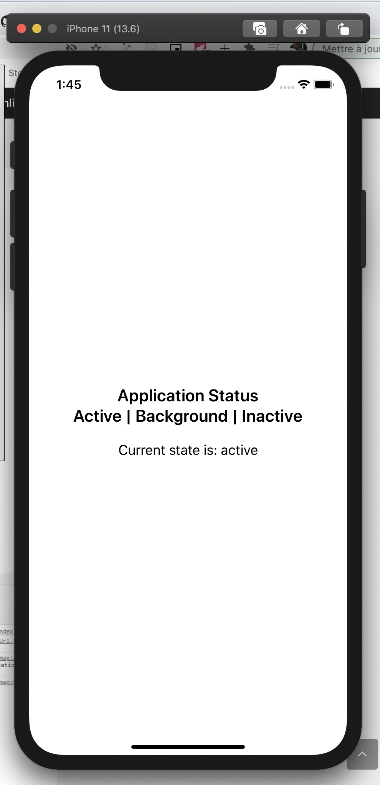
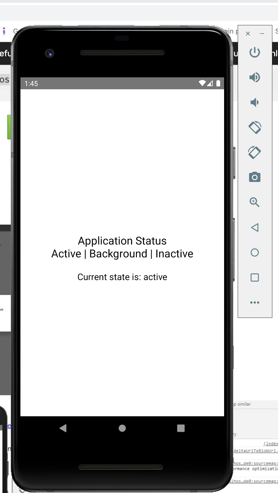

### React Native AppState
This is an example to Get Application State using AppState in React Native. React Native AppState helps you to know the currents state of the application. It will give you the information that the application is in the foreground or in the background, and will notify you on the change of state. AppState is frequently used to determine the intent and proper behavior when handling push notifications.

### Different App States
React Native AppState will provide you the following different App states:

### active
– The app is running in the foreground
### background
– The app is running in the background. The user is either:
using another app
on the home screen
[Android] on another Activity (even if it was launched by your app)
inactive – This is a state that occurs when transitioning between foreground & background, and during periods of inactivity such as entering the Multitasking view or in the event of an incoming call

### `screenShot`

